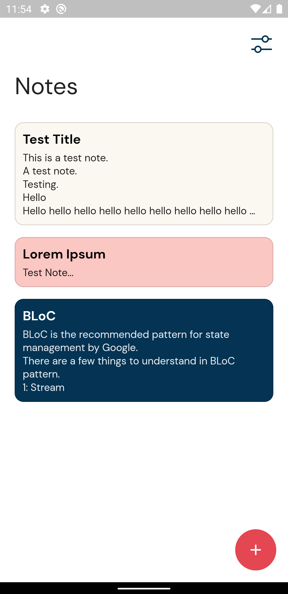
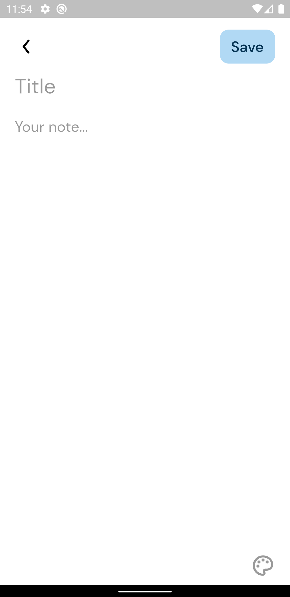
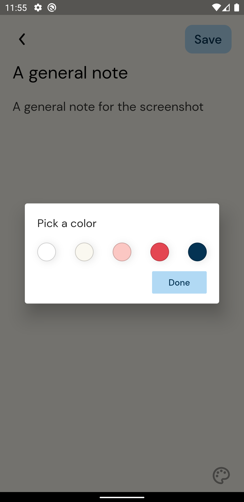
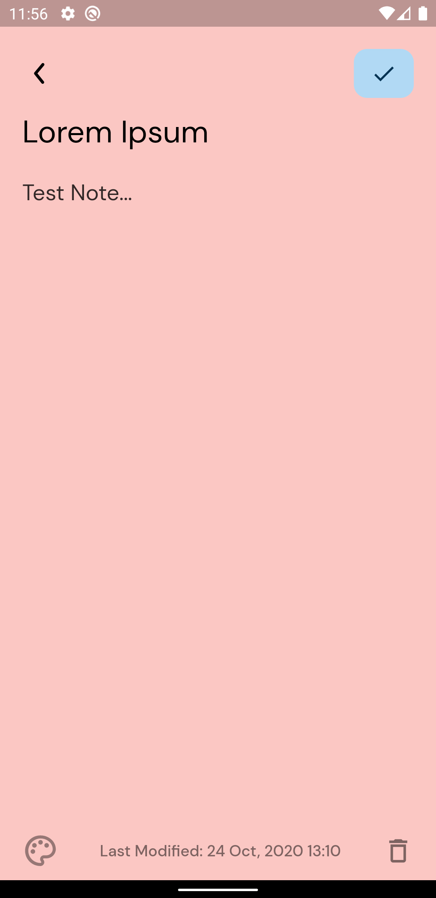

# Notey

A simple minimal note taking app with BLoC pattern as state management.

## Screenshots
<table>
  <tr>
      <td></td>
      <td></td>
      <td></td>
      <td></td>
  </tr>
</table>

## Features
* Register with email and password or with your Google account to access the notes from anywhere.
* Customize the notes with the colors.
* Firebase Firestore as backend database.
* Firebase authentication
* Used BLoC pattern for state management:
 https://pub.dev/packages/flutter_bloc

## Setup
* Create a firebase project:
https://console.firebase.google.com/
* Add an android app and follow the instructions.
* Add an iOS app and follow the instructions.
